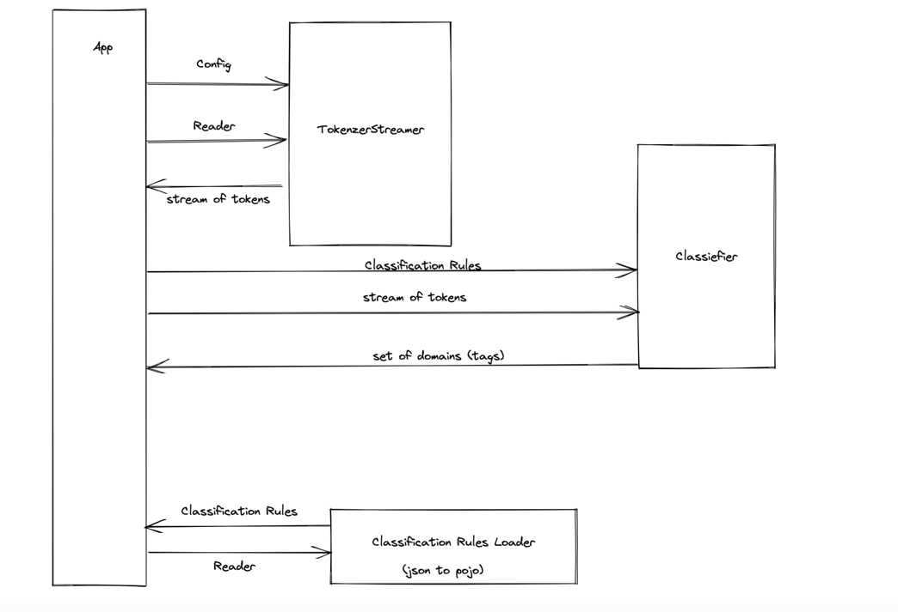

# Text Classifeir

an implementation for the text classifier task which was given [here](https://github.com/Mcas-Interviews/TextClassifier_AviadShiber/issues/1)

### **Build**
to build the project run the following command from root project :

     ./gradlew clean build   

the uber jar will be placed in `build/libs/textclassifier.jar`

### **Run**
command for running the java program:

     java -jar build/libs/textclassifier.jar --config <path_to_json_configuration> --scan <path_to_file_or_directory>   

for additonal help run

     java -jar build/libs/textclassifier.jar --help  

### Design overview

few points about the design:

- The classification rules are loaded via `ClassificationRulesLoader` , with the implementation to load `json` from any Reader to `POJO`.
- Since text files can get very big and not fit into memory we stream the tokens. `TokenizerStreamer` is an abstraction for `StreamTokenizer` of `java.io` to have `stream()` api, this will lift the tokenzier to be more declartive about how to filter and transform the token before putting into use.
- Each token is normalized so it does not matter if the data which flows is `raw` file or `csv`.
- The `Classifier` is a component with the responsibility to classify the tokens into tags(domains).
- to be able to store the classification rules in compact manner and search each `indicator`, in massive texts I made a `Trie` like data structure which stores in each node a `token`, each `indicator` is splitted into continuation of tokens, and at the leaf nodes we keep a `Set` of `domain`(singleton tags). To cover cases like partially combined indicators we keep a window of tokens (which will never be more than the longest indicator, hence we can be sure it will fit into memory according to the requirements).